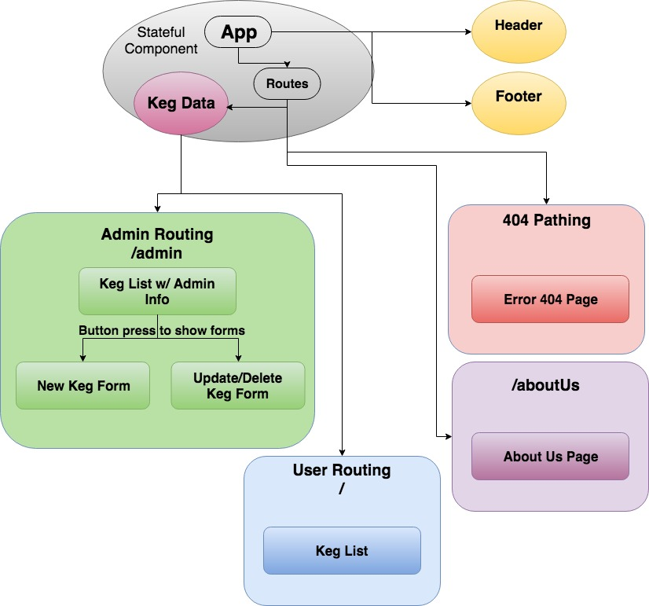

# _Tap Room using React_

#### By: _**Kayl Eubanks**_

## Description

_This app is a clone of a previous project creating a mock tap room website. This is recreating a previous project using JSX and React instead of Angular._

## Setup/Installation Requirement for Developers:

* Clone repository on your local computer from https://github.com/K-Banks/tap-room-react.
* Navigate into project directory in command line.
* Install node package manager if not already installed on local machine.
* Run '$ npm install' to download all needed dependencies.
* Run '$ npm run start' to serve the app on localhost:8080

## Component Tree

## Specs
 *

## Known Issues
_No known bugs at this time._
_Please contact author at kayleubanks@gmail.com with any bugs._

## Technologies Used

 * JavaScript
 * React
 * CSS-Modules
 * JSX

### License

This software is licensed under the MIT license.

Copyright (c) 2018 ****_Kayl Eubanks_****
